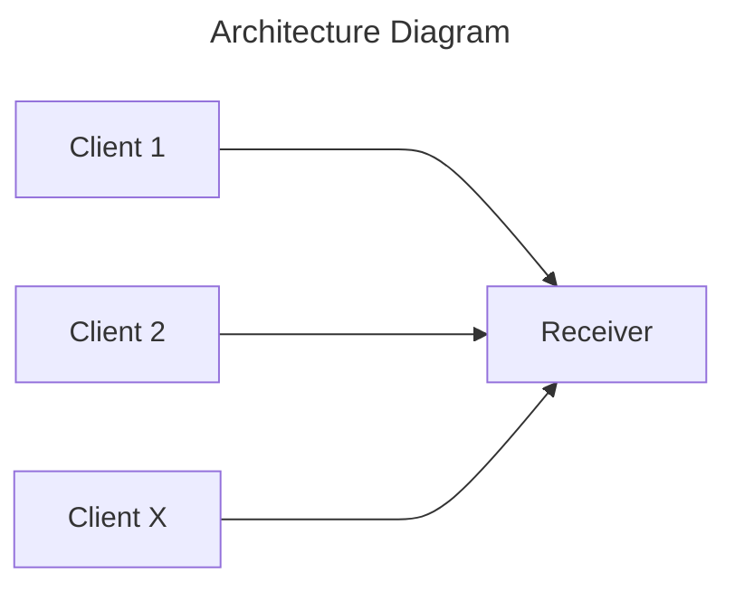

# Rust Application to demonstrate

## Project Description

The aim of this project is to create 2 different segments of rust application code:
1. A TCP Socket, which receives, process and handles messages.
2. A TCP Client (scalable) that sends messages to the aforementioned socket.

These applications will be stored in separate folders and managed via workspaces. 
With the TCP client, the concept is that they are scalable yet have different application layer implementation i.e. sending different data. Therefore a library to handle sending of the messages - yet not the specific type of messages will be implemented.

What it demonstrates:
1. Workspaces
2. Generating a library
3. Managing multiple rust projects within one directory.
4. Concurrency
5. Communication methods TCP sockets and HTTP API
6. Idiomatic error handling.
7. Using traits and where clauses for strict typing and control.